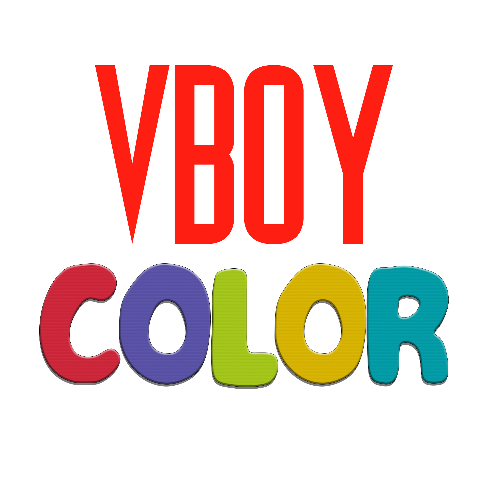
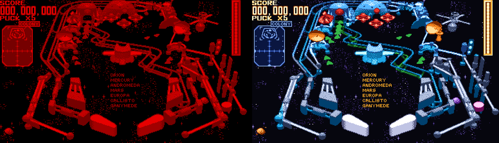
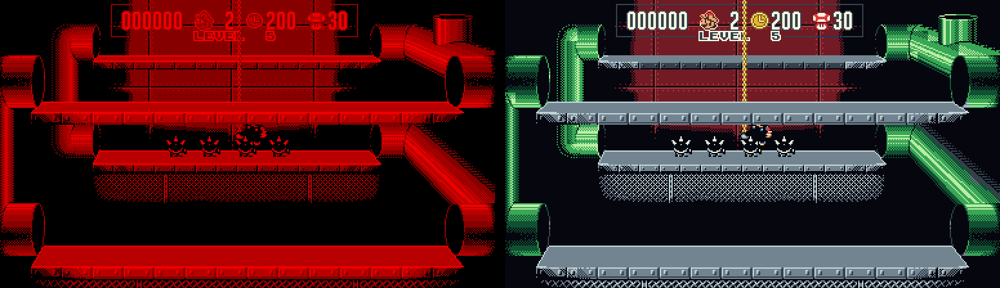
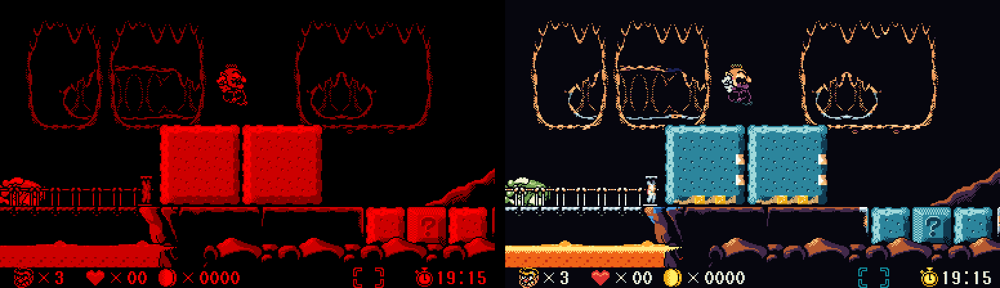
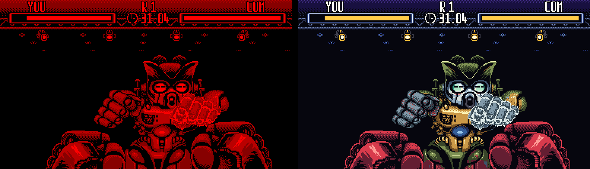
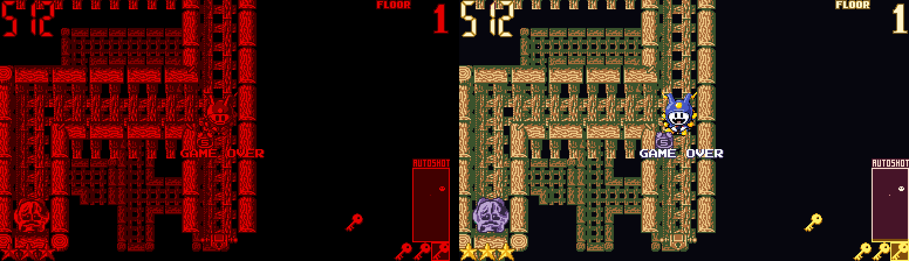
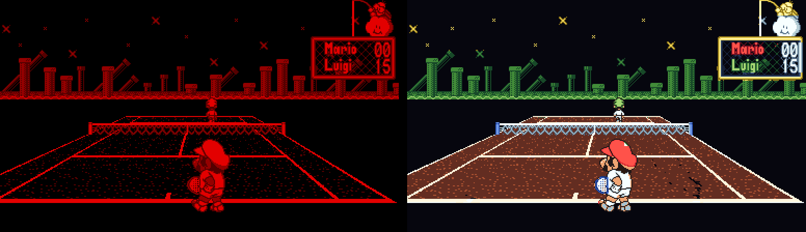

<h1 align="center"></h1>

<b>Virtual Boy games in color - in 3D on Meta Quest, and on PC.</b>

VBoy Color is a free, open-source Virtual Boy emulator. On a Quest headset
it shows games the way the Virtual Boy was meant to be seen, in stereoscopic
3D, but in color instead of red on black. On Windows and Linux it plays them
in a window, no headset needed.

> VBoy Color is an independent fan project. It is not affiliated with,
> endorsed by, or sponsored by Nintendo or Meta. "Virtual Boy" is a trademark
> of Nintendo. No games are included - use only ROMs you made from cartridges
> you own.

*Left: the original. Right: VBoy Color (Auto mode with the game's color
pack).*

## Features

- **Color, four ways** (Settings → Color mode):
  - **Auto** (default) - every pixel is colored by what drew it: background
    layers by their depth (far to near: dusk violet, brick, amber, sand),
    characters by their palette, each with dark/light/lightest steps. What a
    game draws without tiles (Red Alarm's wireframe world, 3-D Tetris's
    well) is colored by how far away it is - the distance between the two
    eyes' pictures - from indigo far away to gold up close. Every game shows
    many colors with no setup.
  - **Multicolor** - each of the Virtual Boy's four shades gets its own color
    (in the spirit of Red Viper's multicolour mode), from a set of palettes.
  - **Gradient** - the game's brightness mapped onto a color gradient
    (Jade, Ocean, Sunset, Ember, Frost, Toxic).
  - **Tint** - the classic look: red, or any color you mix.
- **Color packs** - hand-painted colors for a game, tile by tile, shown in
  Auto and Multicolor modes. Packs for Galactic Pinball, Jack Bros., Mario
  Clash, Mario's Tennis, Panic Bomber, Teleroboxer, Vertical Force and Wario
  Land are built in, plus the menus and HUD of Red Alarm and 3-D Tetris
  (their 3-D worlds are drawn without tiles, so Auto colors them by depth)
  and the scenery of V-Tetris; 3-D Tetris's and V-Tetris's characters are
  still to be painted. Packs hold only colors, no game graphics. A `.vbcp` file next to a ROM overrides the
  built-in one, and you can paint your own on PC: see
  [docs/COLOR_PACKS.md](docs/COLOR_PACKS.md).
- **Colors per game** - every Virtual Boy game starts in the scheme that
  suits it best (picked game by game: Red Alarm's wireframes by depth,
  Golf's fairways green, Virtual Bowling's lanes in Sunset wood...),
  and remembers yours once you change it.
- **A library of your games** - each one a card with its box art,
  downloaded from libretro's thumbnail collection (keep playing while it
  comes). A game without box art, or with no internet, gets its title
  screen in its own colors instead, made on your device (nothing of any
  game ships with the app); Settings → Download box art off shows title
  screens for all. As a list (Y) or last played first (X), and all games
  or only those with a color pack (the chip at the top, or Settings → Only
  games with color packs). Pick with the
  sticks, a gamepad, the mouse, or by pointing a Quest controller and
  pulling its trigger.
- **Real 3D on Quest** - each eye gets its own picture, as on the hardware,
  and both eyes always show the same colors.
- **Save states** - several slots per game, with thumbnails in color.
- **Button mapping** - Quest controllers, gamepads and keyboard, all
  remappable.
- **Screen looks** - Settings → Screen → Look: *Sharp* pixels, *Smooth*
  (OmniScale's rounded edges and diagonals) or *LED* (the Virtual Boy's
  own rows of light, with a soft glow). Both eyes always get the same
  look, so the 3D stays clean.
- **Screen placement** - size and distance of the screen in VR; on PC,
  Settings → Screen → Size: as big as the window allows (*Fit*) or *Whole
  pixels*.
- **Your room as the background** (Quest) - Settings → Adjust screen →
  Show your room around it: the game floats in your room (passthrough)
  instead of in the dark.
- **Video recording** (PC) - F12 records the original red and the colored
  version side by side, frame for frame, for comparison videos (F12 again
  to stop; it stops on its own after ten minutes).
- **Tool-assisted runs** (PC) - drop a Virtual Boy run from
  [TASVideos](https://tasvideos.org/Movies-VBoy) (a `.bk2` file) on the
  window, or open it with `VBoyColor.exe`: its game (from your `roms`
  folder) plays the whole run by itself, in color - press F12 to record it.
  Your own save stays untouched; when the run ends, you take over.

## Getting started

### Quest (Quest 2, 3, 3S, Pro)

1. Download `VBoyColor-<version>.apk` from
   [Releases](https://github.com/yuk27/VBoyColor/releases).
2. Install it with [SideQuest](https://sidequestvr.com) or
   `adb install VBoyColor-<version>.apk` (the headset must be in developer
   mode).
3. Copy your `.vb` ROMs to a folder on the headset (for example
   `Download/VBoyColor`). The color packs are built in.
4. Open VBoy Color from **Unknown Sources** in the app library and pick that
   folder when it asks.

### Windows

Download `VBoyColor-windows-<version>.zip` from
[Releases](https://github.com/yuk27/VBoyColor/releases), unzip it, put your
ROMs in the `roms` folder and run `VBoyColor.exe`. You can also drop a `.vb`
file on the window, or open one with `VBoyColor.exe`. `VBoyColorVR.exe` is the
VR version for a PC headset (Quest Link, Virtual Desktop or SteamVR).

### Linux

Download `VBoyColor-linux-<version>.tar.gz`, unpack it, put your ROMs in
`roms` and run `./VBoyColor` from that folder. Needs a Vulkan driver.

## Controls

**Menu:** left stick click (Quest controllers and gamepads), the left
controller's Menu button, or **Tab** or **Esc** on PC (gamepad: Guide or
left stick click). Some PC VR runtimes keep the Menu button for themselves - the stick
click always works. In the menu: sticks / D-pad / arrow keys move, A (Enter)
picks, B (Esc) goes back - out to the sidebar, or back to the game. The
mouse and the Quest controllers' lasers (trigger) work too.

| Virtual Boy | Quest controllers | Keyboard | Gamepad (PC) |
|---|---|---|---|
| Left D-pad | left stick | arrow keys | D-pad |
| Right D-pad | right stick | W A S D | right stick |
| A / B | A / B | X / Z | A / B |
| L / R | left / right trigger | Q / E | LB / RB |
| Start / Select | Y / X | Enter / Backspace | Start / Back |

Everything can be remapped in Settings → Button mapping. On PC,
**Alt+Enter** toggles fullscreen.

## Building

See [docs/BUILDING.md](docs/BUILDING.md) - Windows, Linux and Quest, all from
one CMake project. Every push is built by GitHub Actions.

## Support the project

https://github.com/sponsors/yuk27

## License

VBoy Color is free software under the **GNU General Public License v3.0**
(see [LICENSE](LICENSE)). The emulator core, Beetle VB, is GPL-2.0-or-later.
Other components and fonts are listed in
[THIRD-PARTY-NOTICES.md](THIRD-PARTY-NOTICES.md).

## Thanks

- **[VirtualBoyGo](https://github.com/CidVonHighwind/VirtualBoyGo)** by
  CidVonHighwind - VBoy Color started as a fork of its OpenXR + Vulkan
  rework. The VR app, renderer, menu, save states and button mapping come
  from there. Thank you for building it and sharing it.
- **[Beetle VB](https://github.com/libretro/beetle-vb-libretro)** - libretro's
  fork of Mednafen's Virtual Boy emulation, the emulator core. It is compiled
  untouched, apart from a generated hook in its video code that reports which
  tile drew each pixel (`cmake/PatchBeetleVip.cmake`).
- **[Red Viper](https://github.com/skyfloogle/red-viper)** - the Virtual Boy
  emulator for the 3DS, for the idea of coloring the four shades (its
  multicolour mode). No Red Viper code is used.
- The libraries and fonts listed in
  [THIRD-PARTY-NOTICES.md](THIRD-PARTY-NOTICES.md).
